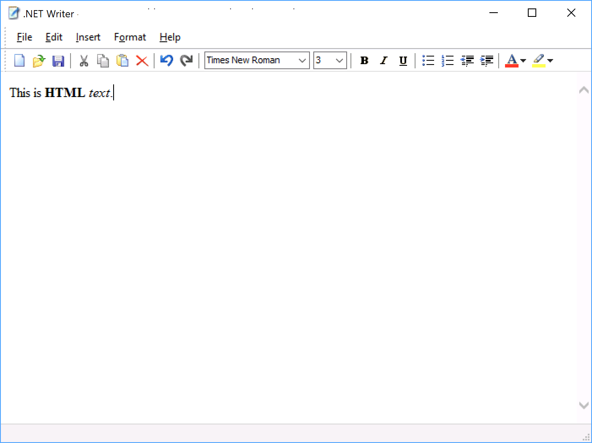

# .NET Writer

Writer is a simple WYSIWYG HTML editor for Windows. 

Writer supports text layout and formatting, hyperlink editing and insertion of dates and pictures.

The app is written in C# hosting the MSHTML ActiveX control.

